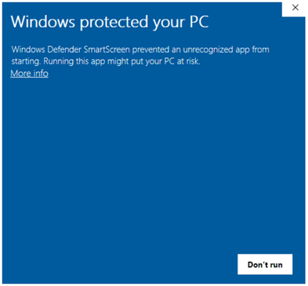
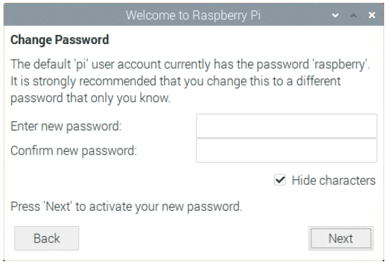

# Raspberry Pi 桌面初级套件 含树莓派4B 4G主板

# 产品介绍

当我们开始学习树莓派时，我们必须购买一系列的配件，非常麻烦。为此，我们特别设计了这个包含了树莓派大部分配件的套件。只要你拿到这个套件，就可以直接开始实验。

套件主要包含树莓派 4代 B 4GB RAM控制板，一个美规电源，32G存储TF卡，读卡器，树莓派外壳，Micro HDMI转HDMI转接头，和hdmi线等元件。

特别注意：1、套件中自带的是树莓派 4代 B 4GB RAM 控制板。

2、各个地方电源规格不同，这个套件用的是美规电源。

# 清单

|编码|名称|规格型号|数量|图片|
|-|-|-|-|-|
|1|美规电源|树莓派4代/4B电源适配器 5V 3A带开关按钮Type-C接口主板供电器（美规）|1||
|2|树莓派外壳|树莓派4代4B外壳+风扇 透明|1||
|3|树莓派开发板|Raspberry Pi4 Model B 树莓派 4代 B 4GB RAM|||
|4|树莓派散热片|14*12*5.5MM 树莓派 raspberry pi 二代 小金鱼铜散热片3片装|1||
|5|读卡器|USB高速读卡器2.0手机音响micro SD读卡器TF卡迷你小|1||
|6|TF卡|朗科手机内存32g存储相机行车记录仪4K高清监控microsd卡专用tf卡 CLASS 10|1||
|7|SD卡套|小卡转大卡SD卡套|1||
|8|胶盒|SD卡 TF卡 白色保护盒 环保|1||
|9|hdmi线|micro hdmi转hdmi线 高清数据线 micro hdmi 线1米|1||
|10|螺丝刀|3*83MM总长 黑色 十字螺丝刀|1||
|11|树莓派转接头|树莓派 Raspberry pi 用hdmi转vga转接头带音频（黑色）|1||
|12|转接头|Micro HDMI转HDMI转接头手机XT800 mb810 HTC P990 XT720|1||

# 安装树莓派-简介

本节你将会学习到树莓派，还有你使用它所需要的东西以及如何安装它。

# 安装树莓派-准备工作

## 树莓派4B

树莓派4自带的内存有1GB, 2GB还有4GB的，对于大部分教学为目的还有那些树莓派爱好者来讲，1GB是足够的。对于要作为台式电脑使用的，我们推荐2GB。

## 电源

所有型号的树莓派都有一个USB接口（在许多手机上都能找到）来连接电源插座的。

USB-C是用于树莓派4的

你需要以下电源：

能够给树莓派4供电至少3.0安倍的电流

## microSD卡

树莓派还需要一个SD卡来存储其所有文件和Raspbian操作系统。  

您需要容量至少为8 GB的microSD卡。

## 键盘和鼠标

在开始用树莓派之前，你还需要一个USB键盘和一个USB鼠标

设置好树莓派后后，您可以使用蓝牙键盘和鼠标，但是首次安装时需要USB键盘和鼠标。

## 电视或者电脑屏幕

为了查看树莓派的桌面环境，你需要一个显示屏还有连接屏幕和树莓派的线。显示屏可以是电视或者电脑显示器。如果显示屏有内置喇叭，树莓派就可以利用其来发声。

## HDMI

树莓派4有两个HDMI输出接口，接口是兼容大部分现代电视和电脑显示器HDMI接口的。许多电脑显示器可能也有HDMI
或者VGA接口。

树莓派4有两个小的HDMI接口， 你可以用全口HDMI转HDMI
线可以连接两个单独的显示器。

## VGA

一些显示屏只有一个VGA接口

为了把树莓派连接到这样的显示屏上，你可以使用HDMI转VGV和全口HDMI转微HDMI适配器的接口。

附加

## 一个盒子

你可能想把树莓派放到一个盒子里。这没那么重要，但是它能保护树莓派。如果你想的话，可以使用官方用于保护树莓派的外壳。

## 耳机和喇叭

大型号的树莓派有标准的音频接口类似于你智能手机和MP3播放器上的.
如果你想的话，你可以连接耳机或者喇叭这样树莓派就可以发出声音了。如果你连接到树莓派上的显示屏有内置喇叭。那树莓派就可以通过他们来发声。

## 网线

大型号的树莓派有标准的以太网接口来连接到网络。

# 安装树莓派-设置SD卡

如果你有SD卡，但是这个卡又没有 Raspbian
操作系统。或者如果你想重新设置你的树莓派，你可以自己安装它。这样做的话，你需要一个带有SD卡接口的电脑------大部分电脑或者台式电脑都有，或者一个SD卡读卡器。

下载镜像操作系统

能够从树莓派官网下载页面下载所推荐的镜像操作系统。

<https://www.raspberrypi.org/downloads/>

点击匹配你的操作系统的Raspberry Pi Imager
的链接（这里我们选择raspdebian）

通过the Raspberry Pi Imager安装 Raspbian 操作系统

注意：希望安装特别操作系统的高级用户应使用此指南来安装操作系统：

<https://www.raspberrypi.org/documentation/installation/installing-images/README.md>

## 下载并启动Raspberry Pi Imager

用Raspberry Pi Imager可以轻松地安装Raspbian和其他操作系统到你准备要使用的树莓派的SD卡上。

访问树莓派下载页面：

<https://www.raspberrypi.org/downloads/>

点击与你操作系统匹配的 Raspberry Pi Imager链接。

下载完成后，点击启动安装程序。

## 使用 Raspberry Pi Imager

在格式化时候，任何储存在SD卡中的信息将被重写。如果你想要安装 Raspbian
的SD卡当前有文件，例如来自于旧版本树莓派的文件，你可能要先备份这些文件避免永久丢失。

在你启动安装程序时，你的操作系统可能会阻碍你运行，例如，以下Windows系统所给出的信息。  

如果你看到这个页面，点击然后点

按照指示来安装运行Raspberry Pi Imager.

插入SD卡到电脑，或者笔记本的卡槽中

在Raspberry Pi Imager，选择你想要安装的系统和你想要安装此系统的SD卡

注意：把SD卡插入SD卡读卡器，接着把读卡器插入电脑的USB接口，也可以安装Raspberry Pi Imager。

接着只要点击键，

等待Raspberry Pi Imager完成写入，

一旦你看得以下页面，你就可以弹出SD卡了。

# 连接树莓派

现在已经连接好树莓派。用正确的顺序来操作是很重要的，这样才能确保所有的组件是安全的。

将你已经设置的Raspbian（通过NOOBS）系统的SD卡插入到树莓派底部的SD卡的卡槽里。

注意：许多SD卡都可以插入到大的适配器中，你可以使用底部的边缘取出卡。

找到你的鼠标线的USB接口，鼠标连接到树莓派的USB接口（不管你用哪个接口都没关系）。

以相同的方式连接键盘。

确保显示器是接入墙上的插座并且打开的

查看树莓派上的HDMI接口----注意这些接口顶部是平坦的

使用一根线来连接显示屏和树莓派的HDMI接口----如果有必要使用一个适配器

树莓派4

将你的显示屏连接到树莓派4的第一个标有HDMI0的接口

你可以用同样的方法连接到另外一个显示屏

注意：因为树莓派还没有运行，显示屏不会显示任何内容。

如果你想通过网线把树莓派连上网络，可以使用一根网线把树莓派的网络接口接到墙上的网络插座中或者接到你的网络路由器。如果你想无线连接或者不想连接到网络就不必这么做。

如果你使用的显示屏有喇叭，那么可以通过喇叭发声。或者如果你喜欢的话，你可以连接耳机或者喇叭到音频接口。

# 设置树莓派

树莓派没有电源开关的话，你把它连接到电源插座，它就会打开

插入USB电源连接到插座，然后将其连接到树莓派接口

你应该会看到树莓派上红灯亮起，代表树莓派连接电源。在它启动的时候，你会看到树莓出现在你屏幕的左上角。

过几秒后，会出现 Raspbian 桌面。

# 完成设置

如果你是首次启动树莓派，欢迎来到树莓派应用页面将会跳出来引导你完成初步设置。

点击下一步开始设置，

设置国家，语言还有时区，再点击下一步。

给你的树莓派输入一个新的密码然后点击下一步。

连接你的WiFi网络，输入密码点击下一步。

注意：如果树莓派型号没有无线连接功能，你就不会看到这个页面。

点击下一步让向导检查Raspbian的更新并安装（这可能要花点时间），

点完成或者重启，完成设置。

注意：如果有必要更新的话，你只需要重启就可以了。

# 帮助

<https://projects.raspberrypi.org/en/projects/raspberry-pi-setting-up/6>

