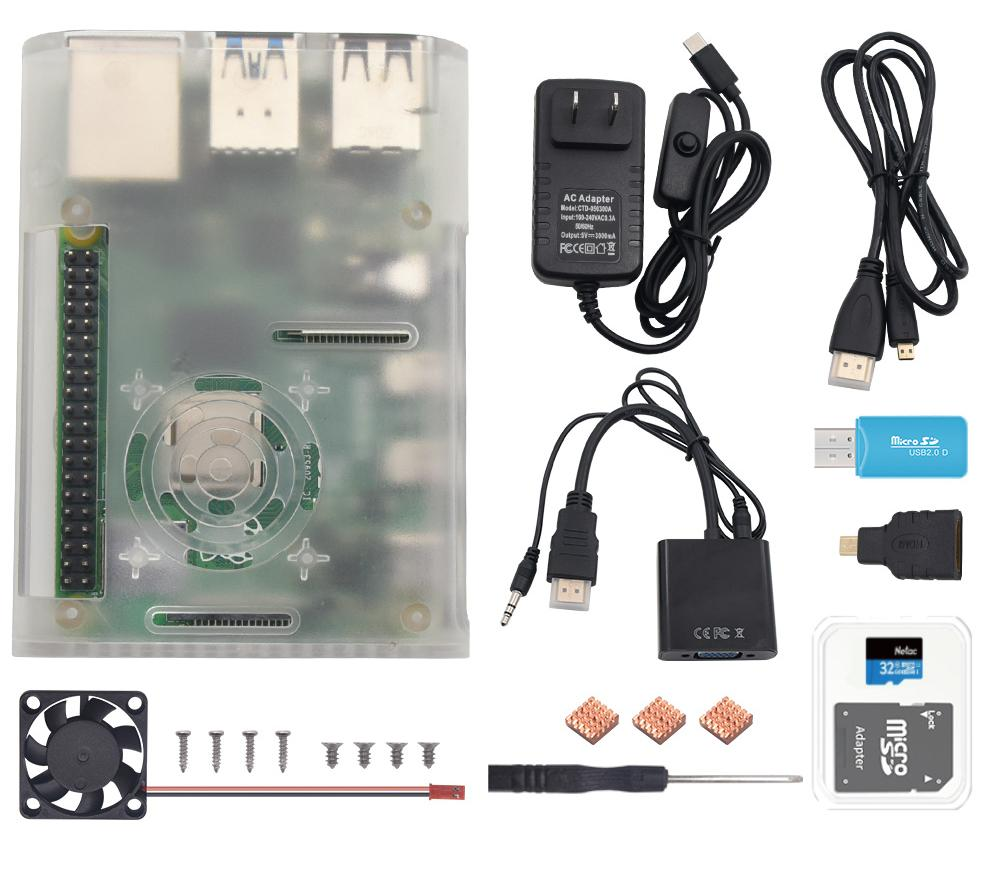

# KE3006 KE3007 KE3008 Raspberry Pi 桌面初级套件 含树莓派4B 4G主板

# 产品介绍

当我们开始学习树莓派时，我们必须购买一系列的配件，非常麻烦。为此，我们特别设计了这个包含了树莓派大部分配件的套件。只要你拿到这个套件，就可以直接开始实验。

套件主要包含树莓派 4代 B 4GB RAM控制板，一个美规电源，32G存储TF卡，读卡器，树莓派外壳，Micro HDMI转HDMI转接头，和hdmi线等元件。

特别注意：
1、套件中自带的是树莓派 4代 B 4GB RAM 控制板。

2、各个地方电源规格不同，这个套件用的是美规电源。

