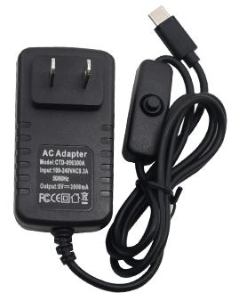
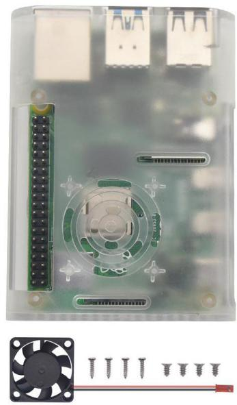
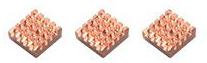
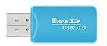
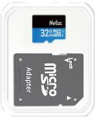
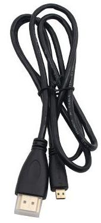
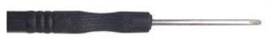
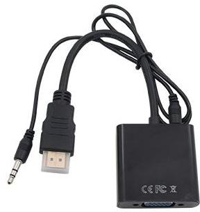
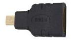

# 清单

|编码|名称|规格型号|数量|图片|
|-|-|-|-|-|
|1|美规电源|树莓派4代/4B电源适配器 5V 3A带开关按钮Type-C接口主板供电器（美规）|1||
|2|树莓派外壳|树莓派4代4B外壳+风扇 透明|1||
|3|树莓派开发板|Raspberry Pi4 Model B 树莓派 4代 B 4GB RAM|||
|4|树莓派散热片|14*12*5.5MM 树莓派 raspberry pi 二代 小金鱼铜散热片3片装|1||
|5|读卡器|USB高速读卡器2.0手机音响micro SD读卡器TF卡迷你小|1||
|6|TF卡|朗科手机内存32g存储相机行车记录仪4K高清监控microsd卡专用tf卡 CLASS 10|1||
|7|SD卡套|小卡转大卡SD卡套|1||
|8|胶盒|SD卡 TF卡 白色保护盒 环保|1||
|9|hdmi线|micro hdmi转hdmi线 高清数据线 micro hdmi 线1米|1||
|10|螺丝刀|3*83MM总长 黑色 十字螺丝刀|1||
|11|树莓派转接头|树莓派 Raspberry pi 用hdmi转vga转接头带音频（黑色）|1||
|12|转接头|Micro HDMI转HDMI转接头手机XT800 mb810 HTC P990 XT720|1||

